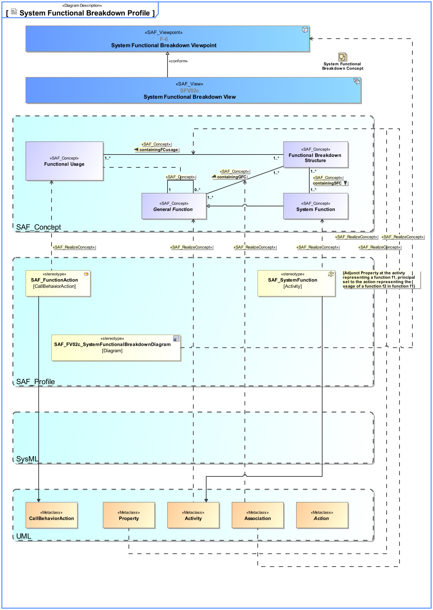

SAF_FFDS#245,SAF_Cameo_Profile#345

# System Functional Breakdown Viewpoint
*Domain:* **Functional** *Aspect:* **Crossreference and Mapping**
## Example

## Purpose
The System Functional Breakdown Viewpoint defines the functional hierarchy of the SoI beginning with identified System Function(s) further down to decomposed partial Function(s). The reuse of partial Function(s) over Function Trees of the SoI is demonstrated.
## Applicability
The System Functional Breakdown Viewpoint supports the "System Requirements Definition Process" activities of the INCOSE SYSTEMS ENGINEERING HANDBOOK 2015 [§4.3] and contributes to the System Function Definition.
Note:
## Stakeholder
* [Acquirer](../stakeholders.md#Acquirer)
* [Customer](../stakeholders.md#Customer)
* [System Architect](../stakeholders.md#System-Architect)
* [User](../stakeholders.md#User)
## Concern
* How is a critical function decomposed and allocated?
* Which function(s) will the SOI provide?
* Which function(s) and service(s) need to be implemented in SW?
* What are the Capability(s) that are supported by the SOI?
* What is the breakdown of function(s) into sub-function(s)?
* What are the System Function(s) and service(s)?
* What are the Functional Requirement(s) imposed on the SOI?
* What are the Function(s) and service(s) to be implemented?
## Presentation
The result of the [tbd] process is one or more block definition diagram(s) (BDD) featuring [tbd].

## Profile Model Reference
|Stereotype | Description|realized Concept
|---|---|---|
|[SAF_FunctionAction](../stereotypes.md#SAF_FunctionAction)|[tbd]|[Functional Usage](../concepts.md#Functional-Usage)|
|Association||[containingGFC](../concepts.md#containingGFC)|
|Association||[containingFCusage](../concepts.md#containingFCusage)|
|Property||[containingFCusage](../concepts.md#containingFCusage)|
|Activity||[General Function](../concepts.md#General-Function)|
|[SAF_FV02c_SystemFunctionalBreakdownDiagram](../stereotypes.md#SAF_FV02c_SystemFunctionalBreakdownDiagram)|[tbd]|[System Functional Breakdown Viewpoint](../concepts.md#System-Functional-Breakdown-Viewpoint)|
|[SAF_SystemFunction](../stereotypes.md#SAF_SystemFunction)|[tbd]|[System Function](../concepts.md#System-Function)|
## Input from other Viewpoints
### Required Viewpoints
*none*
### Recommended Viewpoints
* [System Process Viewpoint](System-Process-Viewpoint.md)
# Viewpoint Concept and Profile Diagrams
## Concept

## Profile

