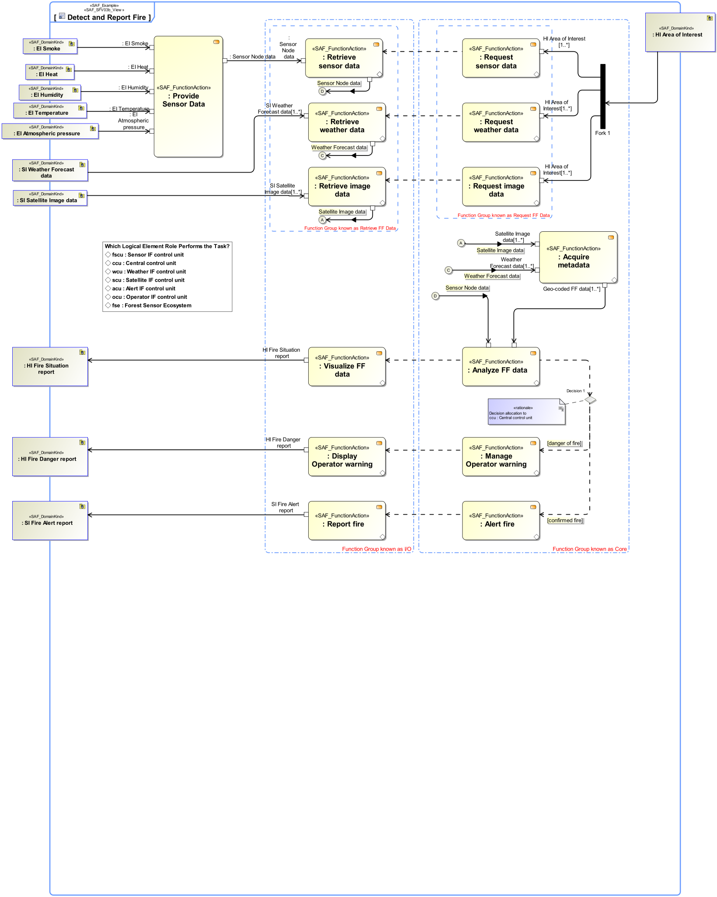

# System Functional Refinement Viewpoint
|**Domain**|**Aspect**|**Maturity**|
| --- | --- | --- |
|[Functional](../domains.md#Domain-Functional)|[Process & Behavior](../aspects.md#Aspect-Process-&-Behavior)|[under construction](../using-saf/maturity.md#under-construction)|
## Example

## Purpose
The System Functional Refinement Viewpoint analyses decomposition of System Functions into System Partial Functions Usage in detail.
## Applicability
The System Functional Refinement Viewpoint supports [tbd].
## Stakeholder
* [System Architect](../stakeholders.md#System-Architect)
## Concern
* How are the system functions decomposed into sub-functions decomposed? 
* What is the breakdown of functions into sub-functions?
## Presentation
Activity Diagram featuring System Partial Functions.

## Profile Model Reference
## Input from other Viewpoints
### Required Viewpoints
* [System Process Viewpoint](System-Process-Viewpoint.md)
### Recommended Viewpoints
* [Operational Context Definition Viewpoint](Operational-Context-Definition-Viewpoint.md)
* [Operational Domain Item Kind Viewpoint](Operational-Domain-Item-Kind-Viewpoint.md)
* [System Context Definition Viewpoint](System-Context-Definition-Viewpoint.md)
* [System Domain Item Kind Viewpoint](System-Domain-Item-Kind-Viewpoint.md)
