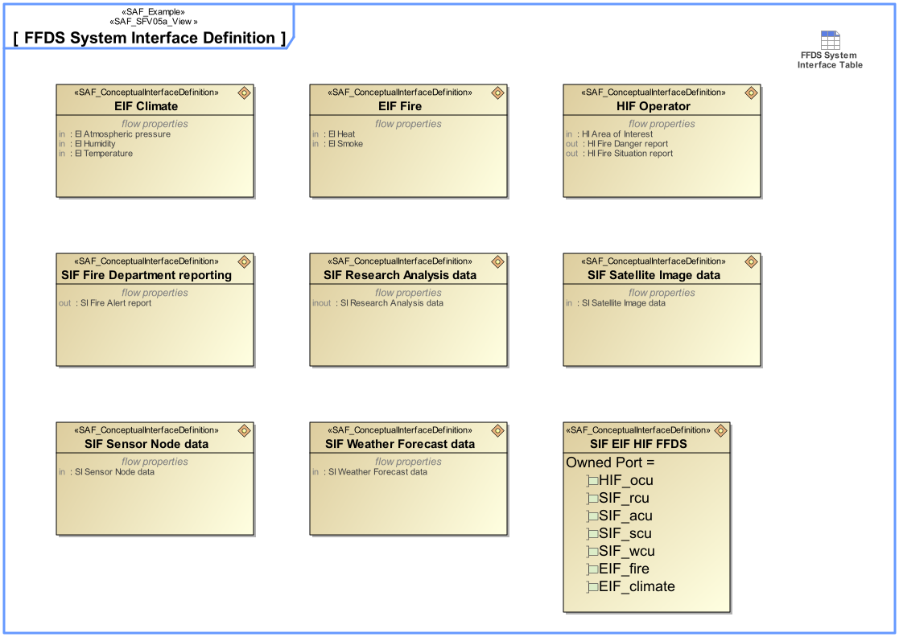

# SAF User Documentation : System Interface Definition Viewpoint
|**Domain**|**Aspect**|**Maturity**|
| --- | --- | --- |
|[Functional](../domains.md#Domain-Functional)|[Interface](../aspects.md#Aspect-Interface)|[released](../using-saf/maturity.md#released)|
## Example

## Purpose
The System Interface Definition Viewpoint captures system wide concepts defining functional interfaces. It allows to adopt long-lived standards and to harmonize the functional interface definitions to improve interchangeability, interoperability, and portability.
## Applicability
The System Interface Definition Viewpoint supports the "Prepare for Interface Requirement Definition" activity included in "System Requirements Definition Process" activities of the INCOSE SYSTEMS ENGINEERING HANDBOOK 2015 [§ 4.3] and contributes to the System Interface definition.
## Stakeholder
## Concern
## Presentation
A block definition diagram (BDD) featuring System Interface blocks with ports, and flow properties.
Note: When ports are used these shall be proxy ports and be typed by interface blocks.

A tabular format listing System Interface blocks, their ports, and flow properties.

## Profile Model Reference
The following Stereotypes / Model Elements are used in the Viewpoint:
* Attribute "" of InformationFlow referencing Connector
* Connector [UML_Standard_Profile]
* FlowProperty contained in InterfaceBlock
* FlowProperty typed by SAF_DomainKind
* FlowProperty [SysML Profile]
* ItemFlow typed by SAF_DomainKind
* ItemFlow [SysML Profile]
* ProxyPort typed by InterfaceBlock
* ProxyPort [SysML Profile]
* [SAF_ConceptualInterfaceDefinition](../stereotypes.md#SAF_ConceptualInterfaceDefinition)
* [SAF_DomainKind](../stereotypes.md#SAF_DomainKind)
* [SAF_SFV05a_View](../stereotypes.md#SAF_SFV05a_View)
## Input from other Viewpoints
### Required Viewpoints
*none*
### Recommended Viewpoints
*none*
