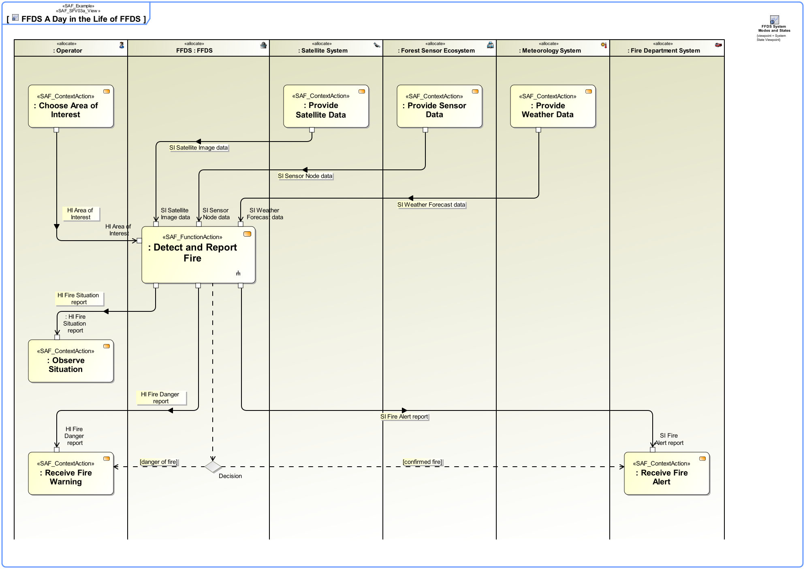

# System Process Viewpoint
|**Domain**|**Aspect**|**Maturity**|
| --- | --- | --- |
|[Functional](../domains.md#Domain-Functional)|[Process & Behavior](../aspects.md#Aspect-Process-&-Behavior)|[released](../using-saf/maturity.md#released)|
## Example

## Purpose
The System Process Viewpoint provides the functional representation of the system using a black-box approach
* the representation of the SOI and all Context Element(s)
* the System Functions the SOI shall be able to perform
* the Context Functions the Context Elements are expected to perform
* the exchange between SOI System Functions and Context Functions of Context Elements
* the functional flows crossing the boundary between SOI and Context Elements

## Applicability
The System Process Viewpoint supports the "System Requirements Definition Process" activities of the INCOSE SYSTEMS ENGINEERING HANDBOOK 2015 [§4.3] and contributes to the System Function Definition and the System Functional Interface Identification.
## Stakeholder
* [Acquirer](../stakeholders.md#Acquirer)
* [Customer](../stakeholders.md#Customer)
* [Hardware Developer](../stakeholders.md#Hardware-Developer)
* [IV&V Engineer](../stakeholders.md#IV&V-Engineer)
* [Operator](../stakeholders.md#Operator)
* [Project Manager](../stakeholders.md#Project-Manager)
* [Safety Expert](../stakeholders.md#Safety-Expert)
* [Security Expert](../stakeholders.md#Security-Expert)
* [Software Developer](../stakeholders.md#Software-Developer)
* [Supplier](../stakeholders.md#Supplier)
* [System Architect](../stakeholders.md#System-Architect)
* [User](../stakeholders.md#User)
## Concern
* How does a system function interact with its environment?
* How is the system interacting with the identified external entities?
* What are necessary inputs for operating the system expected to be provided by other external entitys?
* What are the functional interfaces of the system?
* What are the scenarios a system function is utilized in?
* What is the functional scope of the system?
* What services are expected from external entities?
* Which functions are out of scope of the system?
* Which functions will the system provide?
## Presentation
The Functional Scenario Activity(s) and their sequence related to a System UseCase are represented in activity diagram(s) featuring swim lanes. The swim lanes are typed with Context Element(s) and SOI usage from the System Context(s). 
Note: It is recommended to compile separate activity diagrams refining Use Case and System Context.

## Profile Model Reference
* Allocate [SysML Profile]
* Allocate [SysML Profile]
* ControlFlow [UML_Standard_Profile]
* InputPin [UML_Standard_Profile]
* ObjectFlow [UML_Standard_Profile]
* OutputPin [UML_Standard_Profile]
* Parameter [UML_Standard_Profile]
* [SAF_ContextAction](../stereotypes.md#SAF_ContextAction)
* [SAF_ContextFunction](../stereotypes.md#SAF_ContextFunction)
* [SAF_FunctionAction](../stereotypes.md#SAF_FunctionAction)
* [SAF_LogicalRole](../stereotypes.md#SAF_LogicalRole)
* [SAF_LogicalRole](../stereotypes.md#SAF_LogicalRole)
* [SAF_SFV03a_View](../stereotypes.md#SAF_SFV03a_View)
* [SAF_SystemFunction](../stereotypes.md#SAF_SystemFunction)
* [SAF_SystemProcess](../stereotypes.md#SAF_SystemProcess)
## Input from other Viewpoints
### Required Viewpoints
*none*
### Recommended Viewpoints
* [Operational Context Definition Viewpoint](Operational-Context-Definition-Viewpoint.md)
* [Operational Domain Item Kind Viewpoint](Operational-Domain-Item-Kind-Viewpoint.md)
* [System Context Definition Viewpoint](System-Context-Definition-Viewpoint.md)
* [System Domain Item Kind Viewpoint](System-Domain-Item-Kind-Viewpoint.md)
