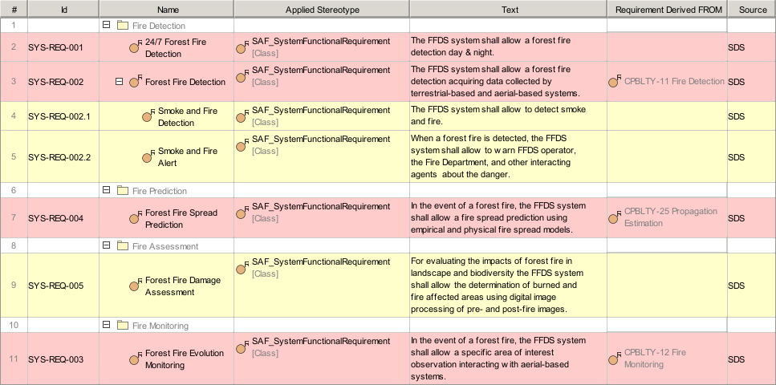

# SAF User Documentation : **F6_SRQD** System Requirement Definition Viewpoint
|**Domain**|**Aspect**|**Maturity**|
| --- | --- | --- |
|[Functional](../domains.md#Domain-Functional)|[Requirement](../aspects.md#Aspect-Requirement)|[released](../using-saf/maturity.md#released)|
## Example

## Purpose
The System Requirement Definition Viewpoint specifies functions, non-functional properties, or constraints of the System. System Requirements are captured, the interrelationships between Functional and Non-Functional Requirements on the same level of abstraction and the traceability to Stakeholder Requirements are depicted.
## Applicability
The System Requirement Definition Viewpoint supports the "System Requirements Definition Process" activities of the INCOSE SYSTEMS ENGINEERING HANDBOOK 2015 [§4.3] and contributes to the System Requirements Verification and Traceability Matrix (RVTM).
## Presentation
A tabular format listing
* unique requirement ID, text, and attributes,
* traceability reference to Stakeholder Requirements,
* traceability reference to depended Requirements on the same level of abstraction.

## Stakeholder
* [Hardware Developer](../stakeholders.md#Hardware-Developer)
* [IV&V Engineer](../stakeholders.md#IV&V-Engineer)
* [Project Manager](../stakeholders.md#Project-Manager)
* [Software Developer](../stakeholders.md#Software-Developer)
* [System Architect](../stakeholders.md#System-Architect)
## Concern
* [What are the exchange requirements imposed on the system?](../concerns.md#_2021x_2_8710274_1674576758978_464279_23425)
* [What are the functional requirements imposed on the system?](../concerns.md#_2021x_2_8710274_1674576758860_195868_23350)
* [What are the non-functional requirements imposed on the system?](../concerns.md#_2021x_2_8710274_1674576758640_180559_23118)
* [What are the requirements of environmental conditions imposed on the system?](../concerns.md#_2021x_2_8710274_1674576758798_122991_23285)
* [What is the range of acceptable system performance, i.e. the critical, top-level performance requirements derived from the operational needs?](../concerns.md#_2021x_2_8710274_1674576759042_480392_23467)
* [Which System Requirements are derived from Stakeholder Requirements?](../concerns.md#_2021x_2_8710274_1674576758563_692887_23057)
* [Which are the interface requirements imposed on the system?](../concerns.md#_2021x_2_8710274_1674576758778_979635_23258)
## Profile Model Reference
The following Stereotypes / Model Elements are used in the Viewpoint:
* [SAF_F6_SRQD_Table](../stereotypes.md#saf_f6_srqd_table)
* [SAF_StakeholderRequirement](../stereotypes.md#saf_stakeholderrequirement)
* [SAF_SystemFunctionalRequirementConstraint](../stereotypes.md#saf_systemfunctionalrequirementconstraint)
* [SAF_SystemFunctionalRequirement](../stereotypes.md#saf_systemfunctionalrequirement)
* [SAF_SystemNonFunctionalRequirement](../stereotypes.md#saf_systemnonfunctionalrequirement)
* [SAF_SystemRequirementDerivation](../stereotypes.md#saf_systemrequirementderivation)
* [SAF_SystemRequirement](../stereotypes.md#saf_systemrequirement)
## Input from other Viewpoints
### Required Viewpoints
* [Stakeholder Requirement Definition Viewpoint](Stakeholder-Requirement-Definition-Viewpoint.md)
### Recommended Viewpoints
* [Operational Story Viewpoint](Operational-Story-Viewpoint.md)
* [Operational Context Exchange Viewpoint](Operational-Context-Exchange-Viewpoint.md)
* [Operational Capability Definition Viewpoint](Operational-Capability-Definition-Viewpoint.md)
* [Operational Process Viewpoint](Operational-Process-Viewpoint.md)
* [Operational Context Interaction Viewpoint](Operational-Context-Interaction-Viewpoint.md)
* [Operational Capability Mapping Viewpoint](Operational-Capability-Mapping-Viewpoint.md)
* [Operational Process Mapping Viewpoint](Operational-Process-Mapping-Viewpoint.md)
