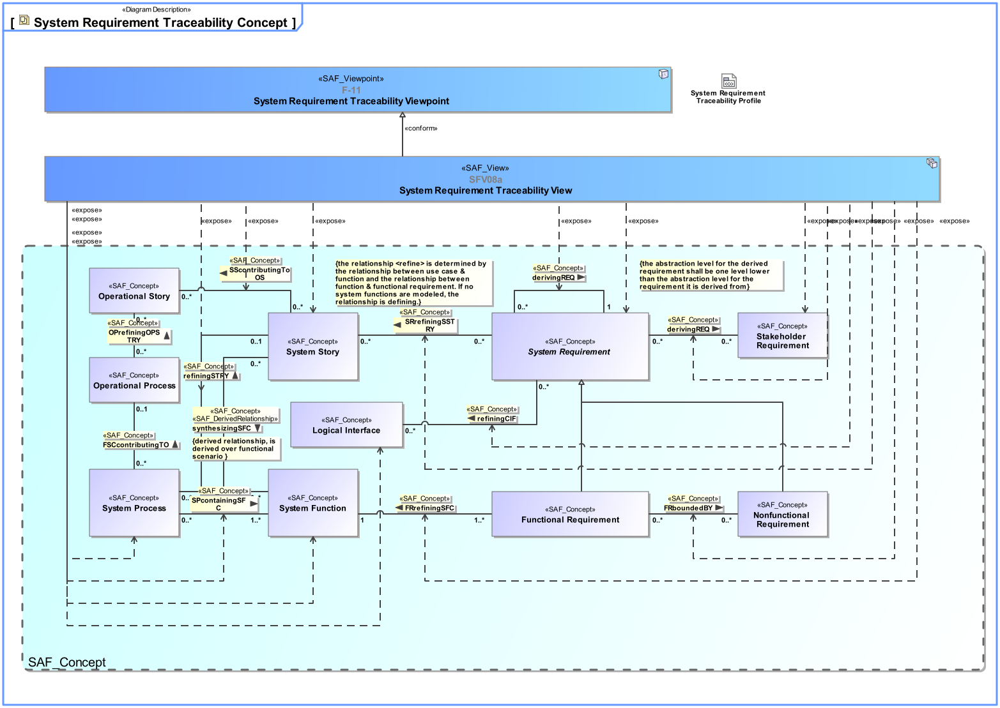
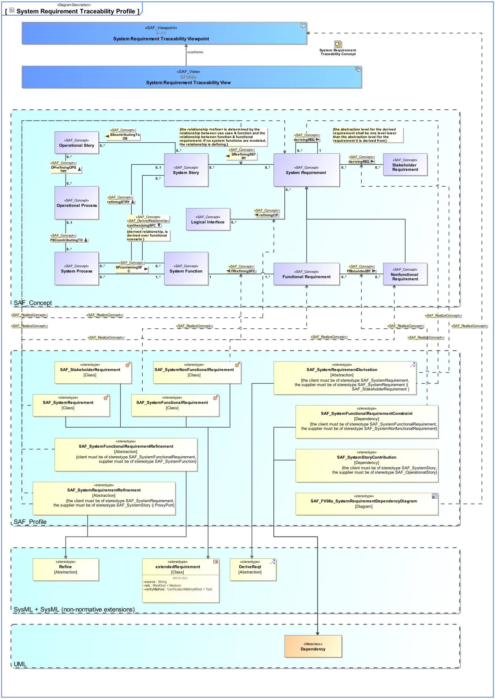

SAF_FFDS#245,SAF_Cameo_Profile#345

# System Requirement Traceability Viewpoint
*Domain:* **Functional** *Aspect:* **Crossreference and Mapping**
## Example
*none*
## Purpose
The System Requirement Traceability Viewpoint specifies [tbd]
For every SOI System Requirement 
[a) the upstream traceability to
* Operational Story
* Operational Context Definition
* Operational Context Exchange
* Operational Capability
* Operational Process
* Operational Interaction
* Stakeholder Requirement]
b) the same level of abstraction traceability to
* System Story
* System Context Definition
* System Context Exchange
* System Functional Scenario
* System Context Interaction
is listed.
## Applicability
The System Requirement Traceability Viewpoint supports the "System Requirements Definition Process" activities of the INCOSE SYSTEMS ENGINEERING HANDBOOK 2015 [§4.3] and contributes to the System Requirements Traceability. The System Requirement Traceability Viewpoint contributes to System Requirements Verification and Traceability Matrix (RVTM).
Note:
## Stakeholder
* [Customer](../stakeholders.md#Customer)
* [Regulation Authority](../stakeholders.md#Regulation-Authority)
* [Safety Expert](../stakeholders.md#Safety-Expert)
* [Security Expert](../stakeholders.md#Security-Expert)
* [System Architect](../stakeholders.md#System-Architect)
## Concern
* Which System Interface is addressed by a System Requirement?
* Which System Function is addressed by a System Requirement?
* What is the rationale for this System Requirement?
* Which Stakeholder Requirement(s) is addressed by a System Requirement?
## Presentation
A System Requirement Dependency Matrix featuring relationship(s) from every SOI System Requirement(s) to element(s) such as
* System Story
* System Context Definition
* System Context Exchange
* System Functional Scenario
* System Context Interaction
Referring to a Stakeholder Requirement the dependency relation is <<derive>>, otherwise <<refine>>.

## Profile Model Reference
|Stereotype | Description|realized Concept
|---|---|---|
|[SAF_SystemRequirementDerivation](../stereotypes.md#SAF_SystemRequirementDerivation)|[tbd]
|[derivingREQ](../concepts.md#derivingREQ)|
|[SAF_FV08a_SystemRequirementDependencyDiagram](../stereotypes.md#SAF_FV08a_SystemRequirementDependencyDiagram)|[tbd]|[System Requirement Traceability Viewpoint](../concepts.md#System-Requirement-Traceability-Viewpoint)|
|[SAF_SystemRequirementRefinement](../stereotypes.md#SAF_SystemRequirementRefinement)|[tbd]
|[SRrefiningSSTRY](../concepts.md#SRrefiningSSTRY)|
|[SAF_SystemFunctionalRequirementRefinement](../stereotypes.md#SAF_SystemFunctionalRequirementRefinement)|[tbd]|[FRrefiningSFC](../concepts.md#FRrefiningSFC)|
|[SAF_SystemRequirementRefinement](../stereotypes.md#SAF_SystemRequirementRefinement)|[tbd]
|[refiningCIF](../concepts.md#refiningCIF)|
|[SAF_SystemNonFunctionalRequirement](../stereotypes.md#SAF_SystemNonFunctionalRequirement)|[tbd]|[Nonfunctional Requirement](../concepts.md#Nonfunctional-Requirement)|
|[SAF_SystemRequirementDerivation](../stereotypes.md#SAF_SystemRequirementDerivation)|[tbd]
|[derivingREQ](../concepts.md#derivingREQ)|
|[SAF_SystemRequirement](../stereotypes.md#SAF_SystemRequirement)|[tbd]|[System Requirement](../concepts.md#System-Requirement)|
|[SAF_SystemFunctionalRequirement](../stereotypes.md#SAF_SystemFunctionalRequirement)|[tbd]|[Functional Requirement](../concepts.md#Functional-Requirement)|
|[SAF_SystemFunctionalRequirementConstraint](../stereotypes.md#SAF_SystemFunctionalRequirementConstraint)|[tbd]|[FRboundedBY](../concepts.md#FRboundedBY)|
## Input from other Viewpoints
### Required Viewpoints
* [Stakeholder Requirement Viewpoint](Stakeholder-Requirement-Viewpoint.md)
* [System Process Viewpoint](System-Process-Viewpoint.md)
* [System Requirement Viewpoint](System-Requirement-Viewpoint.md)
### Recommended Viewpoints
* [System Context Interaction Viewpoint](System-Context-Interaction-Viewpoint.md)
# Viewpoint Concept and Profile Diagrams
## Concept

## Profile

