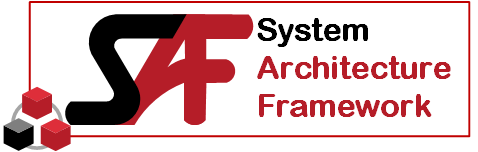
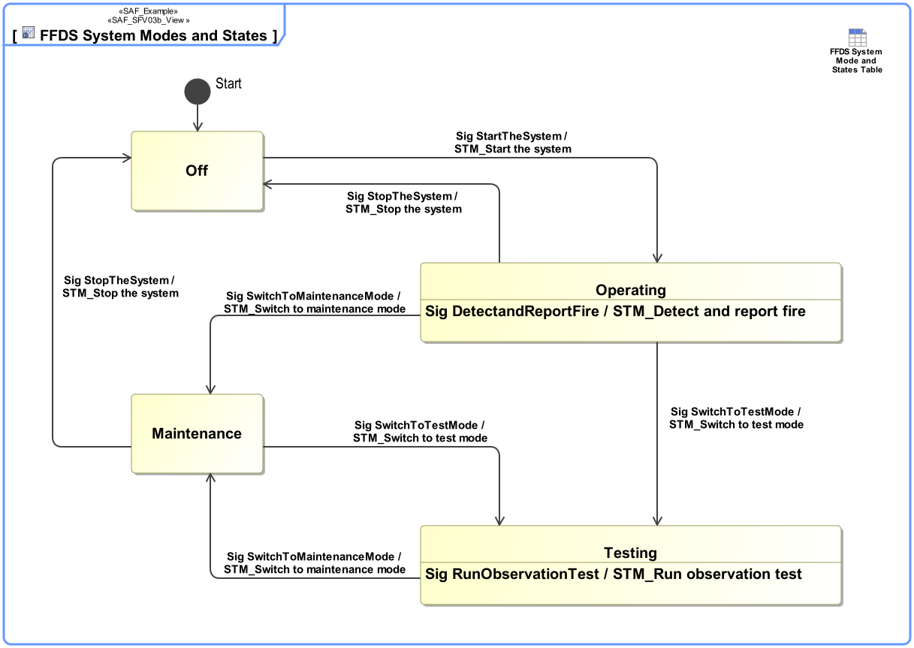

# System State Viewpoint
*Domain:* **Functional** *Aspect:* **Behavior**
## Example

## Purpose
The System State Viewpoint defines the condition(s) of the SOI or parts of it that constrain the execution of System Function(s). A System State is a pre-condition or post-condition of a Use Case, or is used in Requirement(s). The valid transition(s) between System State(s) and the condition(s) for transitioning are specified.
## Applicability
[tbd]
Note:
## Stakeholder
* [Customer](../stakeholders.md#Customer)
* [Maintainer](../stakeholders.md#Maintainer)
* [Safety Expert](../stakeholders.md#Safety-Expert)
* [Security Expert](../stakeholders.md#Security-Expert)
* [System Architect](../stakeholders.md#System-Architect)
* [User](../stakeholders.md#User)
## Concern
* Which system functions are dependent on a systems mode or state?
* Which modes and states does the system have?
## Presentation
[tbd]
Note:

## Profile Model Reference
* Event [UML_Standard_Profile]
* [SAF_DomainKind](../stereotypes.md#SAF_DomainKind)
* [SAF_LogicalElement](../stereotypes.md#SAF_LogicalElement)
* [SAF_SFV03b_View](../stereotypes.md#SAF_SFV03b_View)
* [SAF_SystemFunction](../stereotypes.md#SAF_SystemFunction)
* State [UML_Standard_Profile]
* StateMachine [UML_Standard_Profile]
* StateMachine [UML_Standard_Profile]
* Transition [UML_Standard_Profile]
## Input from other Viewpoints
### Required Viewpoints
*none*
### Recommended Viewpoints
* [System Context Definition Viewpoint](System-Context-Definition-Viewpoint.md)
* [System Domain Item Kind Viewpoint](System-Domain-Item-Kind-Viewpoint.md)
* [System Process Viewpoint](System-Process-Viewpoint.md)
