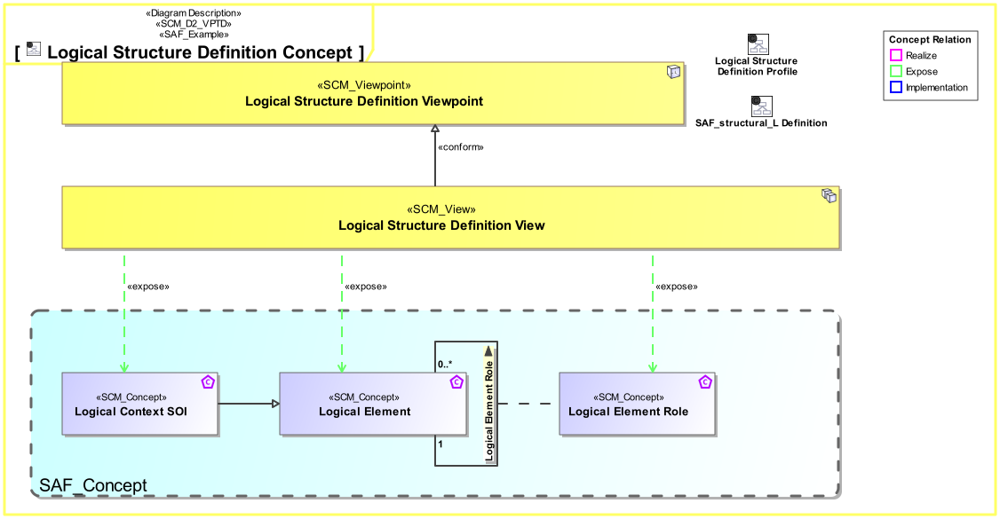

# SAF User Documentation : **D2_VPTD** Viewpoint Definition Viewpoint
|**Domain**|**Aspect**|**Maturity**|
| --- | --- | --- |
|[SAF Development](../domains.md#Domain-SAF-Development)|[Taxonomy & Structure](../aspects.md#Aspect-Taxonomy-&-Structure)|[proposed](../using-saf/maturity.md#proposed)|
## Example

## Purpose
The Viewpoint Definition Viewpoint serves as a specification for any SAF viewpoints in the context of the development of SAF.
The Viewpoint shall specify
* an example of a conforming view
 * purpose
 * applicability 
 * exposed concepts,
 * presentation forms for the conforming views
 * related viewpoints
 * stereotypes used in the conforming views 
## Applicability
The Viewpoint supports the  "Specification of an architecture description framework" as defined in ISO41010:2022
## Presentation
A View and Viewpoints Diagram featuring one *SCM Viewpoint* Element, one *SCM_View* element, a *conform* relationship among them. Additionally all *SCM_Concept* elements that are of interest in the viewpoint. Additionally *expose* relationships for all concepts that help satisfy the viewpoints concerns.
Note, that the consequence of exposing a concept is, that the implementation of the concept must appear in the diagram/table/matrix that implements the viewpoint.

## Stakeholder
* [SAF Developer](../stakeholders.md#SAF-Developer)
* [SAF MBSE approch planer](../stakeholders.md#SAF-MBSE-approch-planer)
* [SAF System model user](../stakeholders.md#SAF-System-model-user)
## Concern
* [How does a viewpoint of the framework the processes and best practises of the INCOSE SE Handbook?](../concerns.md#_2024x_26f0132_1719130644780_901120_14852)
* [What is the definition of a viewpoint of the framework?](../concerns.md#_2024x_26f0132_1719130113094_957740_14764)
* [What is the purpose of a viewpoint in the framwork?](../concerns.md#_2024x_26f0132_1719130556191_78836_14843)
* [Where is a viewpoint of the framework located in the frameworks grid?](../concerns.md#_2024x_26f0132_1719130165383_541840_14769)
* [Which concerns are framed by a viewpoint of the framework?](../concerns.md#_2024x_26f0132_1719130076292_184990_14761)
* [Which dependencies to other viewpoints exist for a viewpoint of the framework?](../concerns.md#_2024x_26f0132_1719130608615_351381_14849)
* [Which presentations are available for a viewpoint in the framwork?](../concerns.md#_2024x_26f0132_1719130583650_18980_14846)
* [Which systems engineering concepts are exposed within a viewpoint of the framework?](../concerns.md#_2024x_26f0132_1719130002321_367858_14758)
## Profile Model Reference
The following Stereotypes / Model Elements are used in the Viewpoint:
## Input from other Viewpoints
### Required Viewpoints
* [Concept Viewpoint](Concept-Viewpoint.md)
* [Concern Viewpoint](Concern-Viewpoint.md)
### Recommended Viewpoints
* [Stakeholder Viewpoint](Stakeholder-Viewpoint.md)
