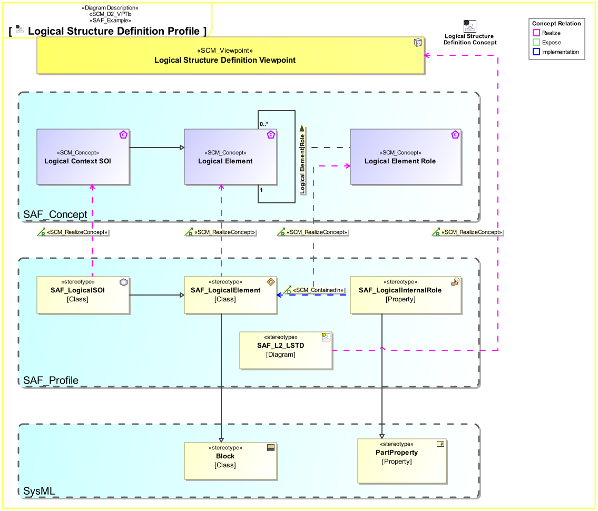

# SAF User Documentation : **D2_VPTI** Viewpoint Implementation Viewpoint
|**Domain**|**Aspect**|**Maturity**|
| --- | --- | --- |
|[SAF Development](../domains.md#Domain-SAF-Development)|[Taxonomy & Structure](../aspects.md#Aspect-Taxonomy-&-Structure)|[proposed](../using-saf/maturity.md#proposed)|
## Example

## Purpose
The Viewpoint Implementation Viewpoint defines the implementation of SE concepts exposed by SAF Viewpoints. It serves as the basis for profile implementations of SAF.
## Applicability
The ... Viewpoint supports the ...  in INCOSE SYSTEMS ENGINEERING HANDBOOK 2023.
## Presentation
A Profile Diagram featuring SCM_Concept elements for the exposed concepts of a viewpoint, stereotypes from the SAF Profile implementing the concepts, and SCM_RealizeConcept relationships tracing the implementation to the implemented concept. If concepts are implemented directly by UML Metaclasses or by SysML profile elements, they shall be shown on the diagram and related to the concepts. There are additional relationships SCM_Attribute, SCM_TypedBy and SCM_ContainedIn, that can be used to specify details of the implementation, e.g. if a concept is to be implemented by the fact that one element is part of an other element. Please see the SAF Development Guide how to do this.

## Stakeholder
* [SAF Developer](../stakeholders.md#SAF-Developer)
* [SAF System model user](../stakeholders.md#SAF-System-model-user)
## Concern
* [How is a viewpoint implemented (which stereotypes /model elements are used)? ](../concerns.md#_2024x_26f0132_1719130358584_780281_14792)
## Profile Model Reference
The following Stereotypes / Model Elements are used in the Viewpoint:
## Input from other Viewpoints
### Required Viewpoints
*none*
### Recommended Viewpoints
*none*
